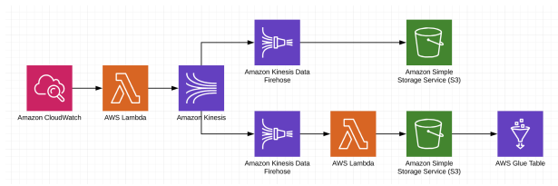

[![LinkedIn][linkedin-shield]][linkedin-url]


<!-- LOGO -->
<br />
<p align="center">
  <a href="https://github.com/kaioalvesc/pic_teste_vers">
    
  </a>

  <h3 align="center">Desafio - Machine Learning Platform Engineer</h3>
</p>


<!-- Indice  -->
<details open="open">
  <summary><h2 style="display: inline-block">Indice</h2></summary>
  <ol>
    <li>
      <a href="#Projeto">Projeto</a>
      <ul>
        <li><a href="#Tecnologias">Tecnologias</a></li>
      </ul>
    </li>
    <li>
      <a href="#Execução">Execução</a>
      <ul>
        <li><a href="#Pré-requisitos">Pré Requisitos</a></li>
        <li><a href="#Instalação">Instalação</a></li>
      </ul>
    </li>
    <li>
        <a href="#Modelo">Modelo</a>
        <ul>
            <li><a href="#Métodos-Testados">Métodos Testados</a></li>
            <li><a href="#Resultado">Resultados</a></li>
       </ul>
    </li>
    <li><a href="#Contato">Contato</a></li>
    <li><a href="#Referências">Referências</a></li>
  </ol>
</details>


<!-- Sobre o Projeto -->
## Projeto

 <a href="https://github.com/kaioalvesc/pic_teste_vers">
    
 </a>


O desafio consiste em implementar uma arquitetura completa que consome a Punk Api no
endpoint https://api.punkapi.com/v2/beers/random e ingere em um Kinesis
Stream que terá 2 consumidores.


### Tecnologias

* [Terraform](https://www.terraform.io/)
* [Python](https://www.python.org/)
* [AWS](https://aws.amazon.com/pt/)


<!-- Execução -->
## Execução 

Para Conseguir executar a criação do ambiente vc deve ter o terraform instalado e um usuário IAM, e gerar uma chave secreta para o usuário

### Pré-requisitos

Segue a lista de acessos necessários para o usuário.
* IAM
  ```sh
  IAMFullAccess
  AmazonAthenaFullAccess
  AmazonKinesisFirehoseFullAccess
  AmazonKinesisFirehoseFullAccess
  CloudWatchEventsFullAccess
  AmazonS3FullAccess
  CloudWatchFullAccess
  AmazonAthenaFullAccess
  AWSGlueServiceRole
  AmazonKinesisFullAccess
  AWSLambda_FullAccess
  ```

### Instalação

1. Copiando Repositório
   ```sh
   git clone https://github.com/kaioalvesc/pic_teste_vers.git
   ```
2. Criar arquivo aws-keys.tfvars no diretório Base do Projeto
   ```sh
   access_key="SUA CHAVE DE ACESSO"
   secret_key="SUA CHAVE SECRETA"
   ```
3. Após isso executar o comando abaixo 
   ```sh
    terraform apply -var-file="aws-keys.tfvars" -auto-approve
   ```


<!-- Modelo -->
## Modelo

O modelo de machine learning foi criado com base no database cleaned com o objetivo de predizer o valor do ibus, ibus siguinifica International Bitterness Units("Unidade Internacional de amargura") e é uma escala precisa para medir o amargor da cerveja.


<!-- Métodos Testados -->
### Métodos Testados 

1. Regressão linear
   ```sh
   Em estatística, regressão linear é uma equação para se estimar a condicional de uma variável y, dados os valores de algumas outras variáveis x. A regressão, em geral, tem como objectivo tratar de um valor que não se consegue estimar inicialmente.
   ```
2. Random forest
   ```sh
   Este nome explica muito bem o funcionamento do algoritmo, que irá criar muitas árvores de decisão, de maneira aleatória, formando o que podemos enxergar como uma floresta, onde cada árvore será utilizada na escolha do resultado final
   ```


<!-- Resultado -->
### Resultado

Entre os modelos comparados o que apresentou melhor resultado foi o Random Forest que apresentou ao mesmo tempo o maior R2 e o menor Erro quadrado médio.


<!-- Contato -->
## Contato

Kaio Alves Chaves: email-kaioalvesc@hotmail.com  

Link do Projeto: [https://github.com/kaioalvesc/pic_teste_vers](https://github.com/kaioalvesc/pic_teste_vers)


<!-- Referências -->
## Referências:

● https://registry.terraform.io/browse?provider=aws

● https://serverless.com/examples/aws-java-simple-http-endpoint/

● https://www.youtube.com/watch?v=wgzgVm7Sqlk

● https://www.youtube.com/watch?v=5WykrpB7qS4

● https://www.youtube.com/watch?v=7mBo6pT09RM


[linkedin-shield]: https://img.shields.io/badge/-LinkedIn-black.svg?style=for-the-badge&logo=linkedin&colorB=555
[linkedin-url]: https://www.linkedin.com/in/kaioalvesc/